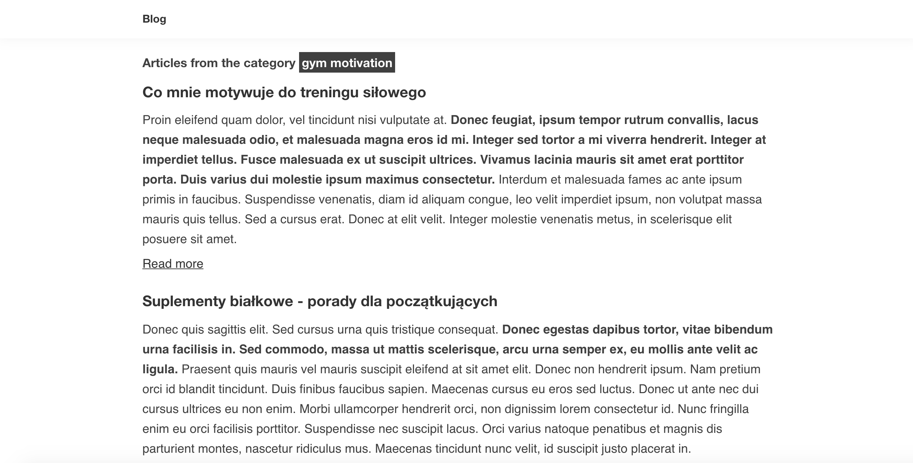

# Blog

### Demo
See the demo on github pages [here](https://lukaszrej.github.io/Blog/). \
Content in the demo is injected directly from a headless CMS.

### Technologies used for this project

- [GatsbyJS](https://www.gatsbyjs.org/)
- [Strapi](https://strapi.io/)
- [SCSS](https://sass-lang.com/)

### Configuration

If you're creating new instance of the blog, process the below actions.\
During installation, you need to use Node.js in a version at least 10.

#### 1. Install Strapi (to create users, articles and categories)

- make sure you are using at least Node.js version >=10
- clone the repo using ```$ git clone```
- navigate from the main folder to the ```cms/strapiCMS``` directory
- install node modules ```$ npm i```
- run ```$ npm start``` and go to the ```localhost:1337``` in the browser
- in the Strapi panel create admin-user (pass and email are needed)
- models for Articles and Categories has been created
- create additional users and insert content for articles and categories
- change the permissions for Users, Articles and Categories in the ```Roles and Permissions```-tab under ```Public``` ('find' and 'findone')

#### 2. Install and run GatbsyJS (to see the result)

- make sure you are using at least Node.js version >=10
- open new terminal in the main folder
- install node modules ```$ npm i```
- start Gatsby using ```$ npm run develop```
- see the result on the ```http://localhost:8000/```
- if you are seeing some problems with fetching content - go to Strapi panel and check the roles for Users/Articles/Categories 
- to build a production version of your instance run ```npm build```

#### Preview





